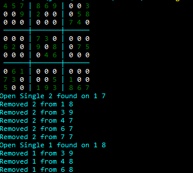

# Sudoku Solver

A Golang implementation of a sudoku solver without using brute force. I made this to learn Go.

## Example:

## Tech:

Python web-scraper to retrieve random puzzles from https://websudoku.com/

Go-based solvers using Open Singles, Hidden Singles and Open Pairs techniques to solve the puzzles.

More difficult puzzles will require additional work on the solve techniques, but what is currently available works for everything on websudoku.